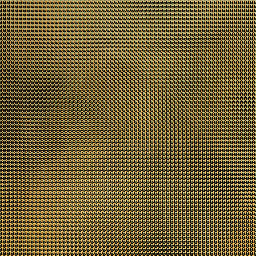
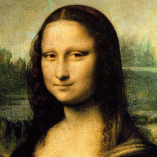

# Bijective image transformation

This project was inspired by
[this](http://www.lifl.fr/~pmathieu/transform/) and
[this](interstices.info/mona-lisa-au-photomaton/).

It is a one day project so it's the most naive implementation.

I'll work on some eventually optimisation or add more transformation
when I can.

## Requirements

* Python's [Pillow](https://pypi.org/project/Pillow/) module.
  You can install it by running this command :
  ```
  pip install pillow
  ```

## Documentation

Run the command below to generate documentation

```
make doc
```

It will create a HTML file in doc/ directory and you can open it with
a web browser. (Documentation is not written yet)

## Run the program

Run it with the command below

```
python3 src/main.py -t photomaton -s 14 images/joconde.png
```

Here is the result


Here is the original image

